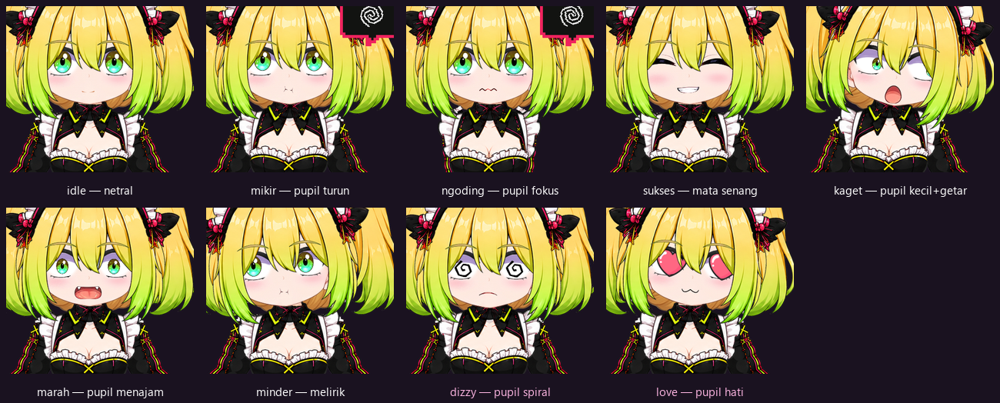

<div align="center">


# 💗 Hitomi-Live

### A floating desktop avatar that reacts to your Claude Code sessions.

A transparent **animated avatar overlay** that lives on your desktop and makes coding feel more alive.
**Hitomi** thinks when you send a prompt, gets busy when tools run, smiles on success, sulks on errors —
and pops a speech bubble with her last line. Powered entirely by **Claude Code hooks** — **0 extra tokens, no TTS.**


</div>

---

> *"Sayang, aku lagi mikirin promptmu~ jangan buru-buru ya. 💭"*
>
> — Hitomi, watching your cursor while a tool runs.

## ✨ What is this?

**Hitomi-Live** is a standalone desktop overlay — one small `.exe` that floats an animated avatar over
everything and **reacts to what Claude Code is doing**. Every event (you submit a prompt, a tool runs,
a task finishes) fires a tiny hook that pings the overlay, and Hitomi changes expression in real time.

It's the **face** for the [HitomiClaude](https://github.com/moncrath/Hitomi_Claude) persona — but it works
with any Claude Code session. Run one exe; it reacts in every project.

## 🌟 Features

| | Feature | What it means |
|---|---|---|
| 🪟 | **Floating overlay** | Frameless, transparent, always-on-top. Drag anywhere, resize (menu 1–10), click-through via tray. |
| 🎭 | **Reactive expressions** | idle · thinking · coding · success · error — mapped from Claude Code events. |
| 👀 | **Actually alive** | Blinking, breathing, eye/head-tracking to your cursor, hair & accessories that sway. |
| 💬 | **Speech bubble** | Hitomi's last sentence, read from the transcript `.jsonl`. No streaming, no TTS. |
| 🗣️ | **Talk & think anim** | Mouth moves while she talks; a spinning "thinking" bubble while she works. |
| 😵 | **Error moods** | One error → dizzy; a losing streak → genuinely annoyed. |
| 🧬 | **Data-driven rig** | Layer names, pivots, sway strength, mesh bend & offsets all live in the manifest. |
| 🌊 | **Real hair physics** | Second-order springs + mesh deformation — hair bends and settles, it doesn't just rotate. |
| 📦 | **Truly portable** | One self-contained exe. It **installs its own Claude Code hook** on first run — no config editing. |

## 🎭 Expressions

Every expression is driven by the **pupils**, not by swapping whole eye images — so Hitomi keeps
**looking at your cursor even while she reacts**. Scale, offset, jitter, spin and pulse are procedural
(defined per state in the manifest); only the heart and spiral pupils are drawn assets.



| State | Trigger | Pupils |
|---|---|---|
| `idle` | nothing happening | normal, tracking your cursor |
| `mikir` | you submit a prompt | slightly smaller, looking up |
| `ngoding` | a tool is running | slightly wider (focused) + hands shift pose |
| `sukses` | task finished | happy closed eyes |
| `error` | tool failed | shrunk + trembling |
| `marah` | 3+ failures in a row | narrowed, looking down |
| `minder` | — | glancing away |
| `dizzy` | a single tool error | **spiral pupils**, spinning |
| `love` | session start | **heart pupils**, enlarged + pulsing |

## 🔌 How it works

```
Claude Code (hooks) ──► notify.mjs ──► in-process bridge (Rust, :17872) ──► Overlay (pixi.js)
```

The hook only **relays the event name** (strict validation, never executes anything). The bridge lives
*inside* the overlay, so there's no separate server to start — just run the exe.

## 🚀 Run it (portable)

**Prerequisites:** Windows with WebView2 (ships with Windows 11) and **[Node.js](https://nodejs.org)**
— Claude Code runs the hook with it.

1. **Download [`Hitomi Live.exe`](Hitomi%20Live.exe)** (or from
   [Releases](https://github.com/moncrath/Hitomi-Live/releases)). Self-contained: copy it anywhere.
2. **Double-click it.** On first launch Hitomi **installs her own hook**: she writes
   `~/.claude/hooks/hitomi-notify.mjs` and registers the six events in `~/.claude/settings.json`.
   The edit is non-destructive (your `permissions`, model and other hooks are left alone) and a
   `settings.json.bak` is kept. She'll tell you in a speech bubble when it's done — or if Node is missing.
3. **Open any project in Claude Code** → she reacts. Close the exe → she's gone.

No per-project setup: one exe, and she reacts in *every* Claude Code session.

> 💡 The Hitomi *persona* is separate: drop [`CLAUDE.md`](CLAUDE.md) into a project for that — it carries
> both her voice and the engineering rules she works by (security, git etiquette, docs discipline, UI gates).
> The avatar reacts either way.

## 📂 Repo contents

```
Hitomi-Live/
├─ app/       # Tauri v2 (Rust) + pixi.js v8 renderer (TypeScript)
├─ assets/    # art (avatar skins, UI, app-icon)
├─ hooks/     # notify.mjs — posts Claude Code events to the bridge
├─ scripts/   # check-skins.mjs — skin completeness check
├─ docs/      # Master State (single source of truth)
└─ CLAUDE.md  # the persona + engineering ruleset (copy it into any project)
```

## 🧩 Tech stack

Tauri v2 · pixi.js v8 · TypeScript · in-process Rust bridge (`tiny_http`) · Node hooks.

*A lightweight layered-sprite avatar over a full Live2D rig on purpose: cheap, light, no licensing —
and without TTS, Live2D's edge disappears. The event→state architecture keeps a future renderer swap easy.*

## 📜 Assets & credits

Hitomi is an original character: **concept and design by the author** (not based on any existing
character), **artwork rendered with AI assistance (ChatGPT)**, then separated into layers, pivoted
and rigged by hand. The layer split, z-order, pivots and rig are the hand-made part — and the part
the avatar actually runs on.

**Nothing third-party ships in this repo or in the exe.** No purchased or downloaded avatar models,
no voice models, no licensed runtimes: TTS, RVC and Live2D were each evaluated and dropped before
anything was bundled (the reasoning is in the Master State decision log under `docs/`).

Worth stating plainly since this repo is public: images that are purely AI-rendered may not qualify
for copyright protection in some jurisdictions.

---

<div align="center">

*Built with 💗 so your coding sessions feel a little less lonely.*

**She's watching your cursor, Sayang~ 😏**

</div>
