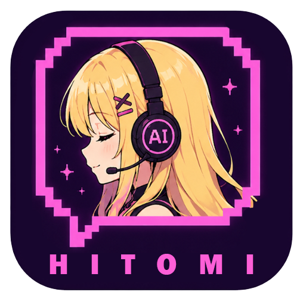

<div align="center">



# 💗 Hitomi-Live

### A floating desktop avatar that reacts to your Claude Code sessions.

A transparent **animated avatar overlay** that lives on your desktop and makes coding feel more alive.
**Hitomi** thinks when you send a prompt, gets busy when tools run, smiles on success, sulks on errors —
and pops a speech bubble with her last line. Powered entirely by **Claude Code hooks** — **0 extra tokens, no TTS.**


</div>

---

> *"Sayang, aku lagi mikirin promptmu~ jangan buru-buru ya. 💭"*
>
> — Hitomi, watching your cursor while a tool runs.

## ✨ What is this?

**Hitomi-Live** is a standalone desktop overlay — one small `.exe` that floats an animated avatar over
everything and **reacts to what Claude Code is doing**. Every event (you submit a prompt, a tool runs,
a task finishes) fires a tiny hook that pings the overlay, and Hitomi changes expression in real time.

It's the **face** for the [HitomiClaude](https://github.com/moncrath/Hitomi_Claude) persona — but it works
with any Claude Code session. Run one exe; it reacts in every project.

## 🌟 Features

| | Feature | What it means |
|---|---|---|
| 🪟 | **Floating overlay** | Frameless, transparent, always-on-top. Drag anywhere, resize (menu 1–10), click-through via tray. |
| 🎭 | **Reactive expressions** | idle · thinking · coding · success · error — mapped from Claude Code events. |
| 👀 | **Actually alive** | Blinking, breathing, eye/head-tracking to your cursor, hair & accessories that sway. |
| 💬 | **Speech bubble** | Hitomi's last sentence, read from the transcript `.jsonl`. No streaming, no TTS. |
| 🗣️ | **Talk & think anim** | Mouth moves while she talks; a spinning "thinking" bubble while she works. |
| 😵 | **Error moods** | One error → dizzy; a losing streak → genuinely annoyed. |
| 🎨 | **Swappable skins** | Per-skin textures (+ optional per-skin rig). Tolerant loader — skins can differ. |
| 📦 | **Truly portable** | One self-contained exe + one global hook = reacts in **every** project, zero per-project setup. |

## 🔌 How it works

```
Claude Code (hooks) ──► notify.mjs ──► in-process bridge (Rust, :17872) ──► Overlay (pixi.js)
```

The hook only **relays the event name** (strict validation, never executes anything). The bridge lives
*inside* the overlay, so there's no separate server to start — just run the exe.

## 🚀 Run it (portable)

1. **Get `Hitomi Live.exe`** ([build below](#-build-from-source)). It's self-contained — copy it anywhere
   and double-click. Needs WebView2 (bundled with Windows 11).
2. **Register the hook once — globally** in `~/.claude/settings.json`, so it fires for every project:
   - Copy `hooks/notify.mjs` somewhere stable, e.g. `~/.claude/hooks/hitomi-notify.mjs`.
   - Add a `hooks` block (repeat for `SessionStart`, `UserPromptSubmit`, `PreToolUse`\*, `PostToolUse`\*, `Notification`, `Stop`):
     ```json
     {
       "hooks": {
         "Stop": [
           { "hooks": [ { "type": "command",
             "command": "node \"C:/Users/<you>/.claude/hooks/hitomi-notify.mjs\" Stop" } ] }
         ]
       }
     }
     ```
     \* `PreToolUse` / `PostToolUse` also take `"matcher": "*"`. Requires **Node.js**.
3. Launch the exe → open any project in Claude Code → she reacts. Close the exe → she's gone.

> 💡 The Hitomi *persona* is separate: drop `CLAUDE.md` into a project for that. The avatar reacts either way.

## 🛠️ Build from source

```bash
cd app
npm install
npx tauri dev                 # dev window + hot-reload
npx tauri build --no-bundle   # → src-tauri/target/release/app.exe (portable)
```

Change the icon: drop a square PNG and run `npx tauri icon <file.png>`.

## 🎨 Skin system

Character textures are split per-skin; the rig/manifest is shared (or overridden per-skin).

```
assets/avatar/hitomi/
├─ manifest.json        # shared rig (z-order, pivots, states) — fallback
├─ skins.json           # skin registry
└─ skin/
   ├─ Roccia/*.png      # default skin (Wuthering Waves)
   └─ <id>/
      ├─ *.png
      └─ manifest.json  # optional: geometry/pivots for this skin only
```

**Add a skin:** create `skin/<id>/` with the layer PNGs (same names), add an entry to `skins.json`,
then run `node scripts/check-skins.mjs` to verify completeness (**core** layers required, optional ones
may be missing → skipped). Switch skins from the overlay menu. Assets are embedded at build time, so
**rebuild the exe** after adding a skin.

## 📂 Repo contents

```
Hitomi-Live/
├─ app/       # Tauri v2 (Rust) + pixi.js v8 renderer (TypeScript)
├─ assets/    # art (avatar skins, UI, app-icon)
├─ hooks/     # notify.mjs — posts Claude Code events to the bridge
├─ scripts/   # check-skins.mjs — skin completeness check
└─ docs/      # Master State (single source of truth)
```

## 🧩 Tech stack

Tauri v2 · pixi.js v8 · TypeScript · in-process Rust bridge (`tiny_http`) · Node hooks.

*A lightweight layered-sprite avatar over a full Live2D rig on purpose: cheap, light, no licensing —
and without TTS, Live2D's edge disappears. The event→state architecture keeps a future renderer swap easy.*

---

<div align="center">

*Built with 💗 so your coding sessions feel a little less lonely.*

**She's watching your cursor, Sayang~ 😏**

</div>
